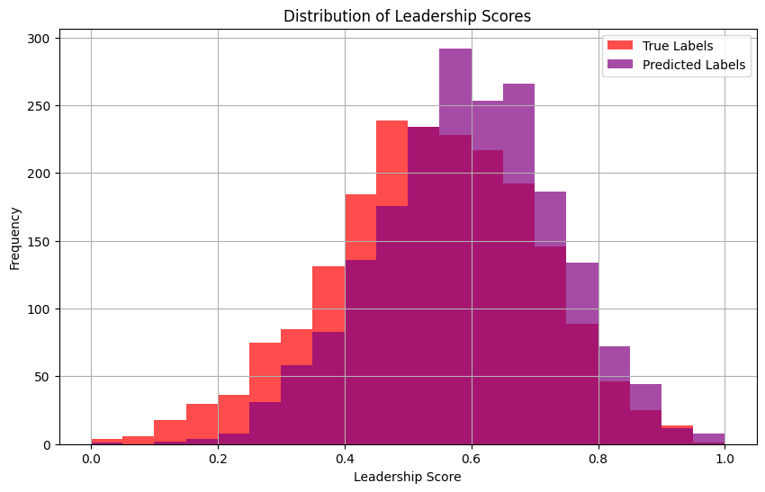
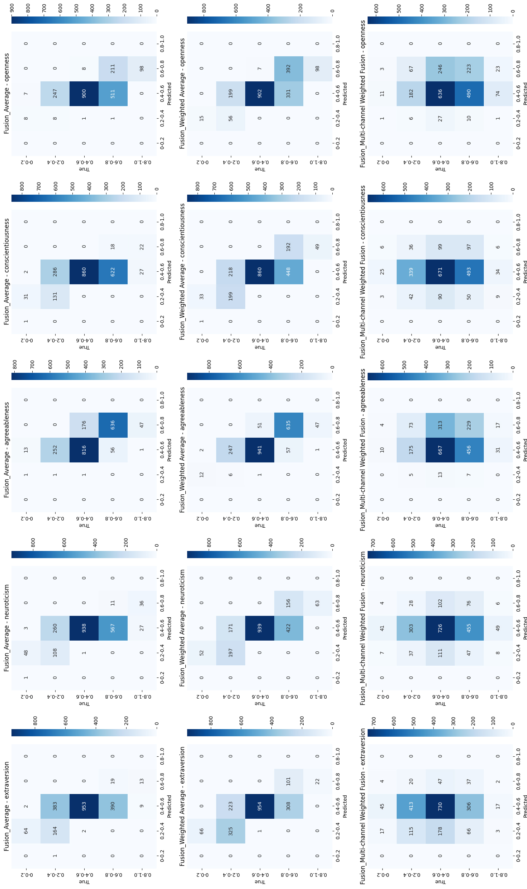

# Charisma-Predictor: Multi-Modal AI for Personality & Leadership Assessment

**Charisma-Predictor** is a multimodal AI pipeline developed as part of a Master's research project in Artificial Intelligence at Maastricht University. It received a final grade of **8.5 / 10**, based on methodology, implementation, and evaluation.

This repository contains the parts I personally developed: the **video model**, the **fusion logic**, and the **charisma scoring and visualization**.

---

## 🚀 Highlights

* 🎥 Video: facial landmark tracking via MediaPipe + five sequence models (CNN, LSTM, GRU, Transformer, TCN)
* 🤖 Ensemble: video outputs fused via weighted averaging (best MAE: 0.1189)
* ⚐️ Fusion: weighted averaging and Multi-Channel Weighted Fusion (MCWF)
* 📊 Output: Big Five personality prediction + charisma score ∈ \[0, 1], classified into five levels
* ⚙️ Optimization: early stopping, learning rate scheduling (ReduceLROnPlateau)
* 📊 Visuals: leadership score distribution, confusion matrices
* ✅ Achieved up to **92.45% accuracy** on Big Five prediction via fusion (MCWF)

---

## 📊 Sample Output

**Leadership Suitability Distribution:**



The fusion output shows high alignment between predicted and true leadership scores, confirming the effectiveness of cross-modal aggregation.

**Fusion Model Personality Accuracy (MCWF):**



---

## 👤 My Contribution

This repository reflects my direct contributions to the project:

* Developed the full **video model pipeline**: feature extraction, five-model ensemble, evaluation
* Designed and implemented **fusion logic**, including MCWF and weighted fusion strategies
* Created the **charisma scoring system** using normalized Big Five trait correlations
* Generated final evaluation metrics, plots, and analysis outputs

---

## 📂 Project Structure

```
charisma-predictor/
├── video_model/            # Facial landmark + sequence model ensemble
├── fusion/                 # Fusion logic (weighted avg, MCWF)
├── figures/                # Output plots (confusion matrices, histograms)
├── results/                # Personality predictions + charisma scores
├── text_and_audio/         # External references to group members' models
│   └── README.md
├── report_links/           # Final report (PDF)
│   └── README.md
├── README.md               # You're reading it
└── requirements.txt
```

---

## 📅 Related Work by Team Members

While this repo focuses on my implementation, the final fusion model also incorporated audio and text inputs from teammates:

* 📄 [Full project report (PDF)](https://drive.google.com/file/d/1LQnHQryJfcT02PuWKHqSIbIRdy0jVY7T/view?usp=sharing)
* 🔊 [Audio model (AST)](https://drive.google.com/drive/folders/1SoNqgf6J3f-QCa_LvFf0fSnW1xZLOgCV?usp=drive_link)
* 📄 [Text model (BERT)](https://drive.google.com/drive/folders/1npBfmOsTbw5ziEsa_PnD_drb8xST2BSP?usp=drive_link)

---

## 🛠️ Run the Fusion Module

This repository includes the training code for the fusion model. To train the Multi-Channel Weighted Fusion (MCWF) model:

```bash
pip install -r requirements.txt
cd fusion
python train_fusion.py
```

---

## 🗋 Dataset

* [First Impressions Dataset](https://chalearnlap.cvc.uab.cat/dataset/20/description/) – 10,000 annotated video clips

---

## 🤓 Methodology Summary

**Model Workflow Overview:**

* 🎥 **Video:** MediaPipe landmark sequences → five-model ensemble (CNN, LSTM, GRU, Transformer, TCN)
* 🔊 **Audio:** AST + Random Forest (team contribution)
* 📑 **Text:** BERT-based personality estimation (team contribution)
* ♻️ **Fusion:** Average, weighted, MCWF
* 🧠 **Output:** Big Five scores → 0–1 charisma score → five-class suitability label
